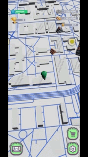
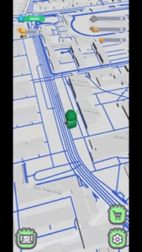

# Wayflare

Wayflare is a 3D multiplayer game prototype where players can explore the environment and interact with objects in real time over a local network.

---

## Gameplay

  

  

  

---

## How to Run the Project

Follow these steps to run the project locally.

### 1. Download the Project

Clone the repository:

git clone https://github.com/Lostirsan/Wayflare.git

Or download it as a ZIP and extract it.

---

### 2. Start the Networking Server

1. Open the **Server** folder  
2. Open the solution file:

Realtime Networking Server.sln

3. Run the server from Visual Studio

Make sure the server is running before starting the game.

---

### 3. Configure Unity

1. Open the project in **Unity Hub**
2. In Unity, go to the top panel:

Developers Hub → Settings

3. Enter the server IP address

---

### 4. Play the Game

You can now:

- Test the project directly in Unity (Play Mode)
- Build the project and run the executable

The game is intended to be played within a **local network**.

---

## Features

- Real-time networking
- Local multiplayer testing
- Interactive environment
- Unity-based gameplay systems

---

## Technologies Used

- Unity Engine  
- C#  
- .NET Networking Server  

---

## Project Structure

Client/   → Unity project  
Server/   → Networking server  
docs/     → Images and GIFs for README  

---

